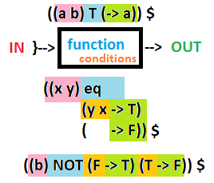

# A Ratify programming language interpreter in Python

> [!NOTE]
> The following is a copy of an email writeup to a corespondent, minimally
modified to be more readable in a markdown format (e.g. lists, codeblocks, notes, etc).
The email was sent on January 17, 2020. As the email was sent to a friend, the
tone is more casual, and any directions that no longer apply have not been
removed, thus the code may not be runnable as is. The code is available in the
file `ratify.py`.

See attached file for the Ratify interpreter source code.

Waaayy longer write up than I initially intended, so if you can get by with just skimming headlines to enable yourself to troubleshoot, then you should only need to really read the "To run" section. Let me know if you have any questions. I included links to some of my sources of inspiration toward the bottom. I would suggest picking something to look at out of that list sooner rather than later because I'd imagine that it is easier to become bored with what I have here for two main reasons: One, what I am basing my work on is much more established than what I've made (naturally); Two, it is difficult to take interest in something that is easily viewed as just more noise among the other numerous and/or practical programming languages available. Hopefully it can be viewed as making actual improvements on fundamental concepts, but we'll have to wait and see.

## To run

   1) Go to http://repl.it/ (no need to sign up).
   2) Click "+ new repl" in the top right corner.
   3) You'll be presented with a drop down selection of languages. Select Python.
   4) Click "Create Repl"
   5) Copy and paste code from the attached file into the text field under the "run" button, in tab labeled "main.py"
   6) Click the "run" button above the text field.
   7) Start playing with the language! Type in the Command Line Interface on the right. (See notes below).

## Command Line Interface (CLI)

   Python's CLI doesn't naturally allow multiple lines when getting user input from a running program. Hitting enter would result in processing that line, requiring the writing of any functions for my language to be written on just one line. This can be much more difficult to read so I added an ugly work around that requires you to press "Ctrl-d" after pressing "Enter" after the last line written.

This allows the writing of Ratify to go from looking like this,

```
((n m) rot10 (0 m -> m @) (1 m -> 0 ((m /@ /@ raw10 /@)) rot10 @) (2 m -> 1 ((m /@ /@ raw10 /@)) rot10 @) (3 m -> 2 ((m /@ /@ raw10 /@)) rot10 @) (4 m -> 3 ((m /@ /@ raw10 /@)) rot10 @) (5 m -> 4 ((m /@ /@ raw10 /@)) rot10 @) (6 m -> 5 ((m /@ /@ raw10 /@)) rot10 @) (7 m -> 6 ((m /@ /@ raw10 /@)) rot10 @) (8 m -> 7 ((m /@ /@ raw10 /@)) rot10 @) (9 m -> 8 ((m /@ /@ raw10 /@)) rot10 @)) $
```

, to looking like this

```
((n m) rot10
     (0 m -> m @)
     (1 m -> 0 ((m /@ /@ raw10 /@)) rot10 @)
     (2 m -> 1 ((m /@ /@ raw10 /@)) rot10 @)
     (3 m -> 2 ((m /@ /@ raw10 /@)) rot10 @)
     (4 m -> 3 ((m /@ /@ raw10 /@)) rot10 @)
     (5 m -> 4 ((m /@ /@ raw10 /@)) rot10 @)
     (6 m -> 5 ((m /@ /@ raw10 /@)) rot10 @)
     (7 m -> 6 ((m /@ /@ raw10 /@)) rot10 @)
     (8 m -> 7 ((m /@ /@ raw10 /@)) rot10 @)
     (9 m -> 8 ((m /@ /@ raw10 /@)) rot10 @)) $
```

   On occasion, particularly when a function, or set of functions, which are self referential get called, the interpreter can get stuck in an infinite loop. This can be confirmed by pressing "Ctrl-d" several times after attempting to run a function. If the `-------<<<STACK>>>-------` indicator does not show up, then press "Ctrl-c" and restart the interpreter by typing "repl()" and pressing the "Enter" key. This should maintain the state of everything (like the stack and function definitions you've made) prior to the infinite loop occurring. The site may timeout and stop the running of the program. You can start it up again by clicking "run", but unfortunately this will not maintain the state you had.

## Some Useful Function Definitions
> [!NOTE]
> The notion of "returns" should be read as, "pushes to the stack"

> [!NOTE]
> On this website you can paste via "Ctrl+Shift+V"

```
   ((w) cls (w -> cls /@)) $  ---   clears stack
   ((w) rem (->)) $               ---   removes one expression immediately prior to it in the stack
   ((x y) T (-> x)) $              ---   returns the first of two inputs (an implementation of True)
   ((x y) F (-> y)) $              ---   returns the second of two inputs ( an implementation of False)
   ((1 2) eq (2 1 -> T) (-> F)) $ --- return "T" if inputs are the same, otherwise returns "F"

   ((b) NOT (-> F T b @)) $ ---   returns "T" if input is "F" and "F" if input is "T" so long as T and F are defined as above
   ((b) NOT (F -> T) (T -> F)) $ --- return "T" if input is "F" and "F" if input is "T" regardless of other definitions

   ((eat until) eater
         (until until ->)
         (-> until eater @)) $  --- will clear out stack items between a choice of terminating expressions
   eater-Example:
             before: a b c d <STOP> e f g h <STOP> eater @
             after:    a b c d
```

   In this example `<STOP>` is used as a terminator and could be replaced by any expression. "eater" takes in the expression nearest it and removes all other terms, cutting its way down the stack until it finds a match. A word of caution: if eater doesn't find it's matching terminator then it will enter into an infinite loop.

```
   ((item lst) prepend (-> (item lst /@))) $ --- takes in two inputs, and presuming the second is a list, adds the first input to the front of the list. So, "a (b c) prepend @" becomes "(a b c)".

   ((d) dup (-> d d)) $          ---   duplicates its input onto the stack
   ((x y) swap (-> y x)) $     ---   swaps the location of x and y in the stack
```

   Interesting quirk: If you highlight and copy all of the lines, from the cls function to the swap function, found in this section, then you can paste ("Ctrl+Shift+V") them into the CLI, hit "Enter", and press "Ctrl-d". The program will then correctly define all of the above specified functions. The comments on those functions will be pushed onto the stack and can be removed via running the now defined cls command by entering `cls @`. If you highlight this paragraph with the lines specified then only this sentence, preceded by a quotation mark and a period, will be left on the stack.

## Language Structure

- An expression is a "word" or a list.
- Language statements modify a stack of expressions and are composed of zero or more expressions.
- Every non empty statement adds expressions to the stack unless there has been a function call or a definition specification.

- A "word" is a string of one or more characters not separated by white-space, excluding special characters. A list is a set of zero or more "words" or lists enclosed with `(` and `)`. Excess white-spaces (eg. spaces, tabs, and newlines) are ignored so code can be formatted to heart's content. Note: a statement like `1+1` is one word given the lack of spaces; `1 +1` is two words, `1` and `+1`; and `1 + 1` is three words, `1` and `+` and `1`. Only spaces and special symbols can separate characters (e.g. `1@1` will be read as a `1` followed by an `@` followed by a `1`). Perhaps the most confusing would be an statement like `' hello'`, which is two expressions, `'` and `hello'` because there is no space between `hello` and the second single quote, and because single quotes (as well as double quotes for that matter) are not special symbols.

- Special  symbols include:`@`, `/@`, `$`, `->`, `(` , and `)`

- `(` and a matching `)` form lists. Lists can be empty.
   `$` following a list matching a valid definition structure will define a function with a user specified function name, and the definition list will be removed from the stack. If it follows anything that is not a list or a list that does not match a valid definition structure then an error will be thrown.

- The `->` arrow is only used specific parts of a definition structure. Use elsewhere will throw an error.

- `@` following a defined function will call that function, following a list will output the expressions in that list to the stack with out the enclosing `(` and `)`, and following a "word" that has not been defined as a function will not do anything. In that last instance a "word" will remain on the stack, but the `@` will not be added to the stack. If there are no expressions in front of `@` nothing will occur and it will not be added to the stack. If it is used inside of a list then it will be added to the stack, but it will be inert while inside of the list, only running once outside of the list.
 
- `/@` produces the same results as `@` with the exception of being nested once inside of a list. If `/@` is inside one list, it will run the same as if it were outside, except the results will be contained within that list. If it is nested twice or more, like so `((/@)) `, it will not run unless it is nested once or less.

- Functions cannot be called without `@` or `/@` listed after there name, and they are treated like any other "word" when not being called. All functions that take in inputs, remove from the stack as many items as they have parameters specified in their definitions. If a function does not push values on to the stack then the stack is shortened by however many values it took off for its inputs. Functions can be specified to not take in any input, in which case they will not take anything off of the stack.

## Definition Structure:



- Red: parameter space
- Blue: function name space
- Orange: condition space
- Green: output space

A valid definition structure is composed of a list containing: A list of parameters, a function name, and then one or more lists of conditions and output. The list of parameters in a definition structure can only contain "words" and the function name must be a "word", no special symbols are allowed. A conditions and output list is composed of: optional "matching words" to compare against inputs, no special symbols allowed; an `->` to delineate between the "matching words" and the corresponding output; and then zero or more of any combination of expressions or special symbols as output. If "words" are specified before the `->` then there must be the same number of "words" before the `->` as there are parameters specified in parameter list before the function name.

When "words" are specified in front of an `->` then the outputs specified after the `->` will only be pushed to the stack if the inputs match the "words" specified before the `->`. If they don't match, then if there is another conditions and output list it will attempt to match against that, otherwise it will simply not output anything. When there are no "words" specified in front of an `->` then it is automatically considered as a match and will output whatever was specified after that `->`.

A special case of condition matching occurs when names used for the parameters are also used before an `->`. In this instance, the value of inputs to the function will be placed before `->` where the corresponding parameter names were used, and then the inputs will be matched against those values.

In the instance of `((a b) T (-> a)) $`, function `T` takes two expressions prior to it in the stack, assigns the first to `a`, assigns the second to `b`, doesn't match against anything, and outputs the values corresponding to `a`.

In the instance of `((1 2) typical (hello world -> 2 , 1 there) (-> goodbye)) $`, function `typical` takes two expressions prior to it in the stack, assigns the first to `1`, and assigns the second to `2`. First, it attempts to match `1`s value to `hello` and `2`s value to `world` and if it succeeds outputs `2`s value, a comma , `1`s value, and `there`, which would add `world, hello there` to the stack. If `1` and `2`s values don't match `hello world` then it will make an attempt on the second condition list which doesn't require any matching an so will just output `goodbye`.

In the instance of `((x y) eq (y x -> T) (-> F)) $`, function `eq` takes two expressions prior to it in the stack, assigns the first to `x`, and assigns the second to `y`. When it comes to matching, because the parameter names are used before the `->` the value of the inputs will be placed before the `->` and the inputs will be matched against those. So, the value of `x` will attempted to be matched against the value of `y`, and `y` against the value of `x`. If they match it will output `T` to the stack, otherwise it will output `F`.

Finally, it should be made know that it is possible to use the name of a defined function as a parameter name. In instances such as these the parameter takes priority, so the value of the input to the function will be used instead of the definition that shares its name with the function parameter. As an example recall from above that we've defined NOT in the first instance as `((b) NOT (-> F T b @))`. If `b` also denoted a function name, then `b @` inside NOT will call whatever function was passed into NOT. It won't run according to `b`'s function definition. If `b` is called elsewhere, outside of another function or when it's name isn't being used as a parameter, then it will run according to `b`'s definition. 

## Errors

   There are two main error types to take note of. As the Ratify language is interpreted with Python, if I have coded the interpreter incorrectly, then Python will throw errors of its own. Otherwise you should hopefully only see the last line of an error traceback prefixed by `SyntaxError: Ratify>`.

   For either type of error the state of the interpreter should not be destroyed and can be started again by typing `repl()` and hitting the "Enter" key. This should put you back where you left off prior to the error, and all of the functions you've written will still be available. If that doesn't do the trick then a complete restart may be in order. In which case you can just hit "stop" where the "run" button was, above the text field where you were asked to paste the interpreter's source code.

   If the last line of an error traceback is not prefixed by `SyntaxError: Ratify>`, then you might consider taking notes on some of the statements/commands that you ran prior to receiving such an error.

## Inspiration

   Leading factor, ... lambda calculus notation: https://en.wikipedia.org/wiki/Lambda_calculus  

   Forth wiki: https://en.wikipedia.org/wiki/Forth_(programming_language)  

   Lisp paper: http://languagelog.ldc.upenn.edu/myl/llog/jmc.pdf
      Which I found in the article How Lisp Became God's Own Programming Language: https://twobithistory.org/2018/10/14/lisp.html

   Opinion Essay on Lisp: http://www.paulgraham.com/avg.html

   Starting point for my interpreter: http://norvig.com/lispy.html

## Conclusion: The Name

   The first name was "condi", because I initially was exclusively only using arrows (->), inspired by conditional if-then statements from logic. In the same vein I moved on to calling it "ify". Fitting given I didn't see it as super practical. Then when it became more Forth like I had started adding "@"s to call functions which naturally dominated the landscape, more so than the arrows did. It wasn't just "ify" anymore, so I added "@" to the name but knew calling it Atify wouldn't sound nice. I tossed an "R" in front and it became Ratify. The definition of "ratify": to sign or give formal consent to (a treaty, contract, or agreement), making it officially valid. This seems fitting in the context of coding declarations. Some languages have mascots (You can guess what Python's is) and, name wise, a rat is the most fitting. R.A.T. as an acronym also has a technology associations such as "Remote Access Tool" or "Radio Access Technology".

## Bonus:
   Uncomment line 194 in the interpreter code by removing the `#` to see every iteration of the interpreter dealing with the expressions it has been given. This will require you to stop and start the program again which will wipe out any saved definitions.
